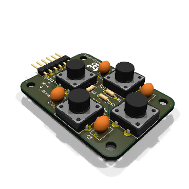
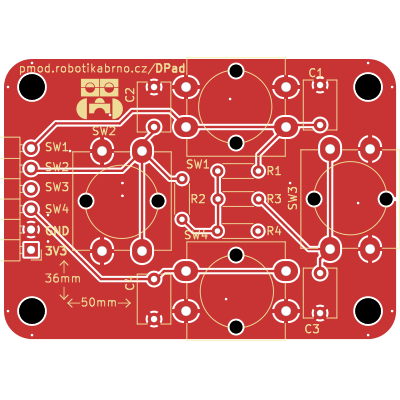
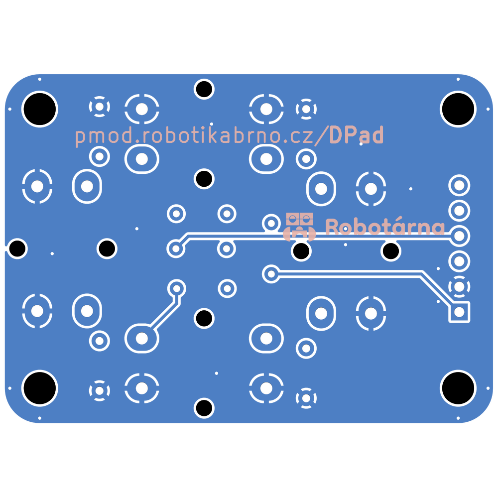
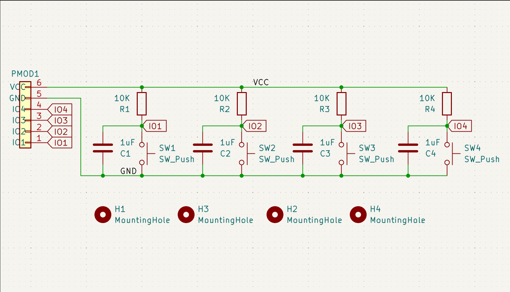

# D-Pad Modul

Tento modul poskytuje čtyři tlačítka (switche) pro ovládání zařízení. Slouží k jednoduchému zadávání příkazů nebo navigaci v rozhraní.

[Manuál](manual.md){ .md-button .md-button--primary }

|  |  |
| --- | --- |

