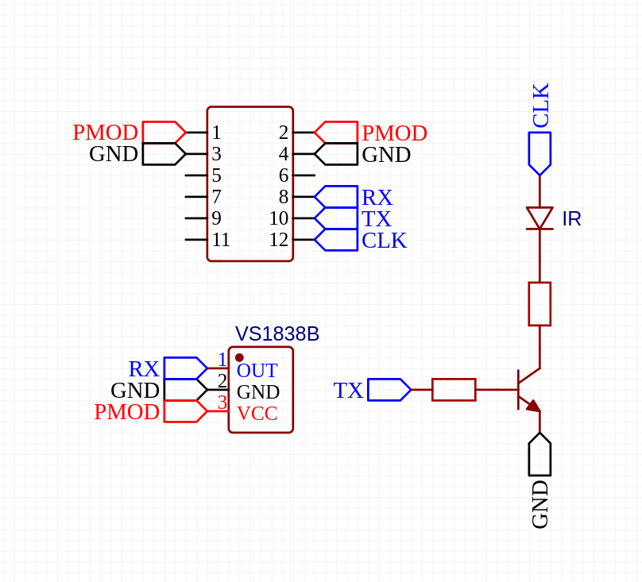

# IR přijímač/vysílač

IR přijímač/vysílač založený na [IR diodě](https://www.laskakit.cz/ir-vysilac-led-5mm-940nm/) a [VS1838B](https://www.laskakit.cz/ir-prijimac-vs1838b/)

Jsou potřeba 3 piny
- RX (signál z VS1838B)
- TX
- CLK (38 KHz signál který očekává přijímač na druhé straně)

