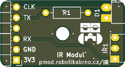
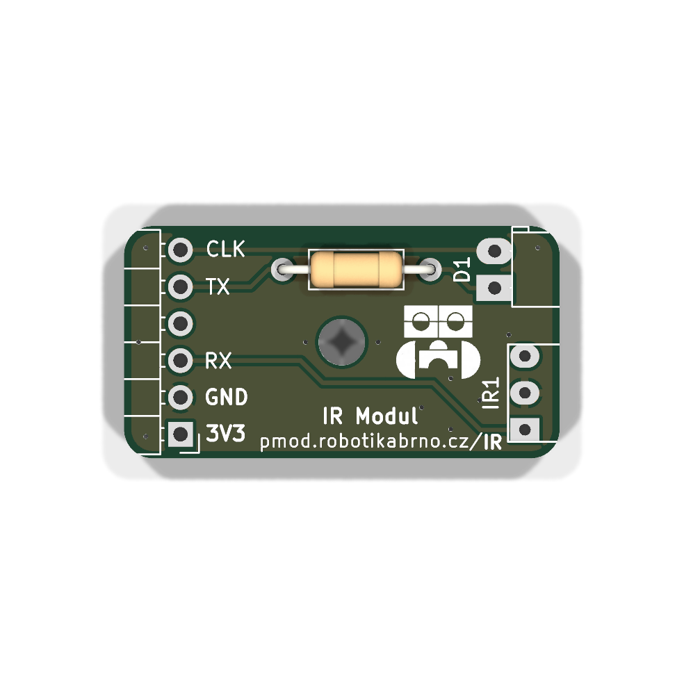
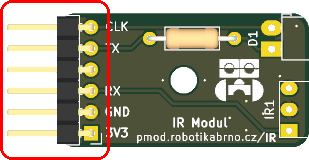
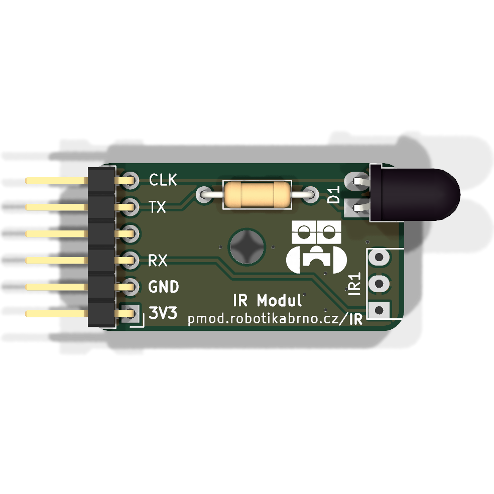
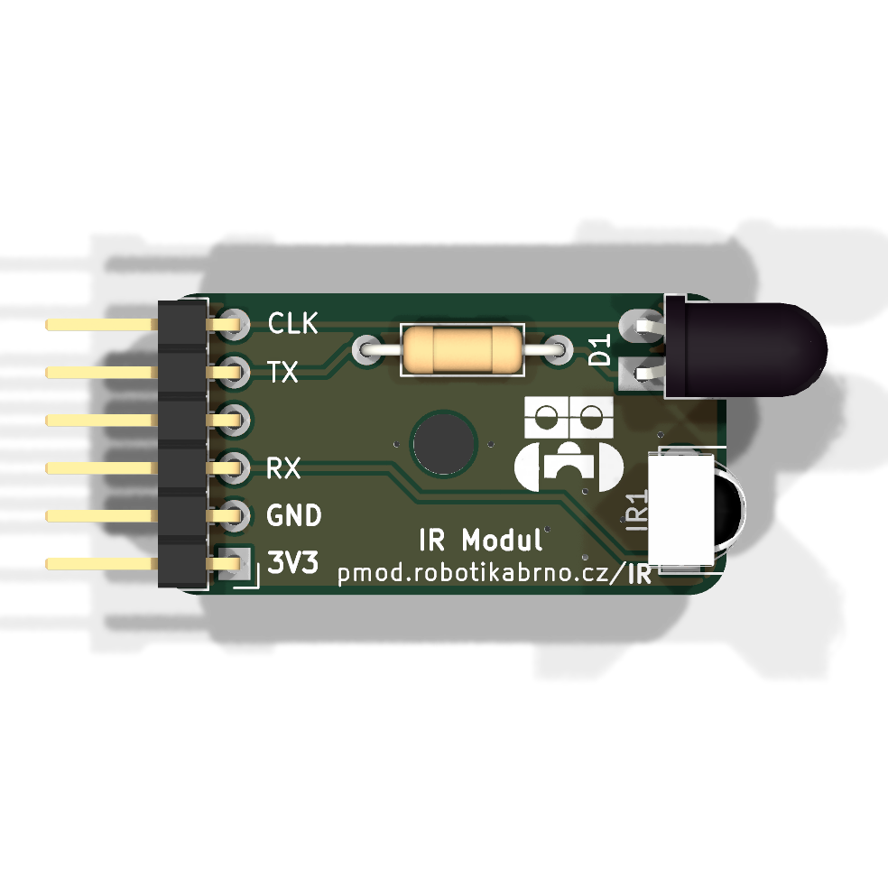

# Manuál k modulu

## Součástky

| Označení | Typ                     | Hodnota | Počet |
| -------- | ----------------------- | ------- | ----- |
| IR1      | IR senzor               | VS1838b | 1     |
| D1       | dioda                   | —       | 1     |
| J1       | pinový konektor 2.54 mm | —       | 1     |
| R1       | rezistor                | 100 Ω   | 1     |

### 1. Prázdná deska

Prázdná deska připravená k osazování.

### 2. Rezistor

Zapájejte rezistor **R1** (**100 Ω**) na horní stranu DPS.

### 3. Pinový konektor 2.54 mm

Zapájejte pinový konektor **J1** na horní stranu desky.

### 4. Dioda

!!! danger "Pozor"
    **D1** (dioda) — Dioda je polarizovaná — zkontrolujte orientaci anody a katody před pájením.

Zapájejte diodu **D1** (dioda) na horní stranu desky.

### 5. IR senzor

Zapájejte **IR1** (IR senzor, **VS1838b**) na horní stranu DPS.

