# Manuál k modulu

## Součástky

| Označení | Typ                     | Hodnota        | Počet |
| -------- | ----------------------- | -------------- | ----- |
| C2       | kondenzátor             | 0.01 µF        | 1     |
| C1       | kondenzátor             | 0.2 µF         | 1     |
| C4       | kondenzátor             | 1 µF           | 1     |
| C3       | kondenzátor             | 100 pF         | 1     |
| MK1      | mikrofon                | CMEJ-9745-37-P | 1     |
| J1       | pinový konektor 2.54 mm | —              | 1     |
| RV1      | potenciometr            | 100 kΩ         | 1     |
| R1, R2   | rezistor                | 1 kΩ           | 2     |
| R3, R4   | rezistor                | 1 mΩ           | 2     |
| R5       | rezistor                | 10 kΩ          | 1     |
| U1       | zesilovač signálu       | LMV321         | 1     |

### 1. Prázdná deska

Prázdná deska připravená k osazování.

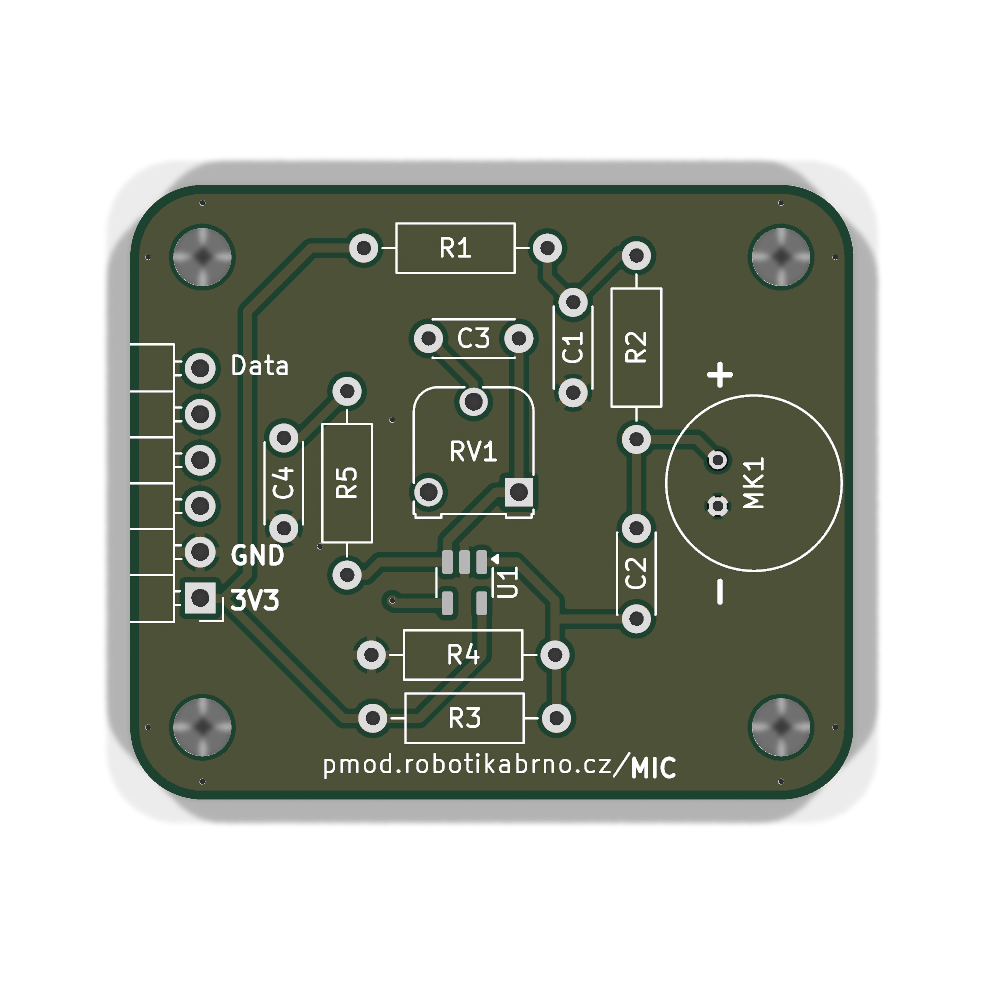

### 2. Zesilovač signálu

!!! warning "Pozor"
    **U1** (**LMV321**) — Zkontrolujte správnou orientaci součástky podle orientační značky nebo pinu 1 na pouzdře.

Zapájejte zesilovač **U1** (**LMV321**) na horní stranu DPS.

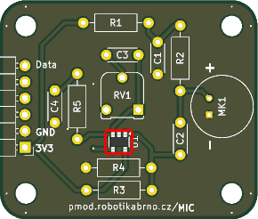

### 3. Rezistory

Osadťe rezistory **R1** a **R2** (**1 kΩ**) na horní stranu DPS.

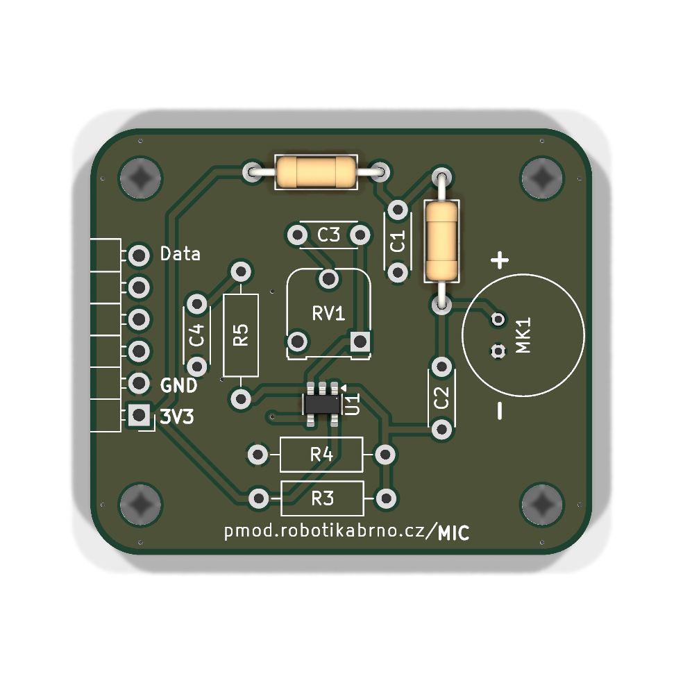

### 4. Rezistory

Zapájejte rezistory **R3** a **R4** (**1 mΩ**) na horní stranu DPS.

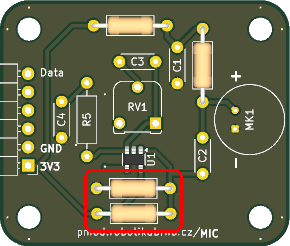

### 5. Rezistor

Zapájejte rezistor **R5** (**10 kΩ**) na horní stranu DPS.

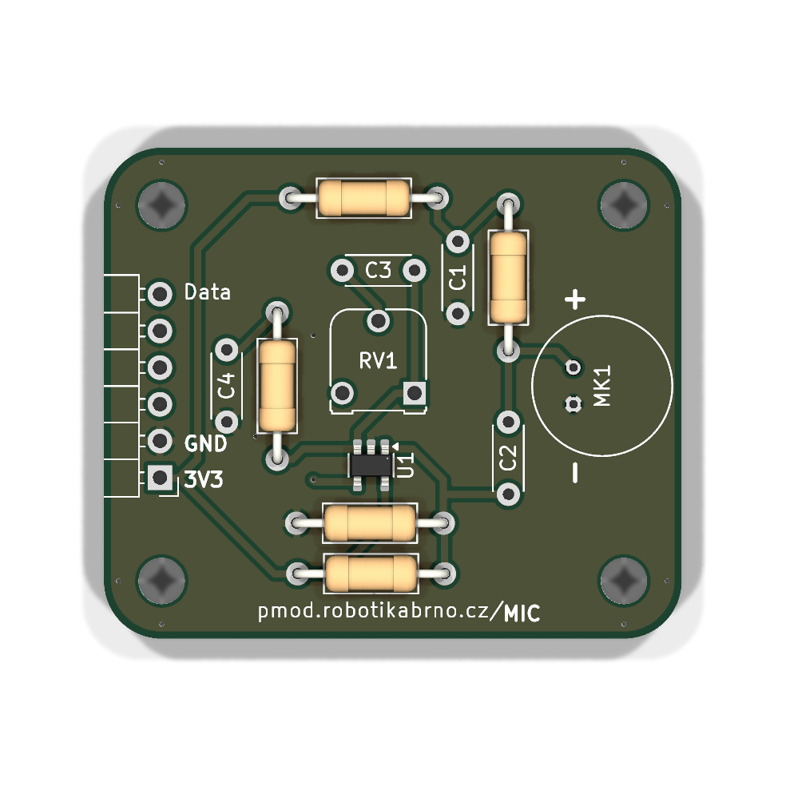

### 6. Kondenzátor

Zapájejte kondenzátor **C1** (**0.2 µF**) na horní stranu DPS.

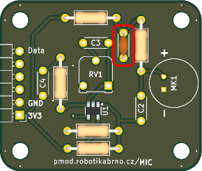

### 7. Kondenzátor

Zapájejte kondenzátor **C2** (**0.01 µF**) na horní stranu DPS.

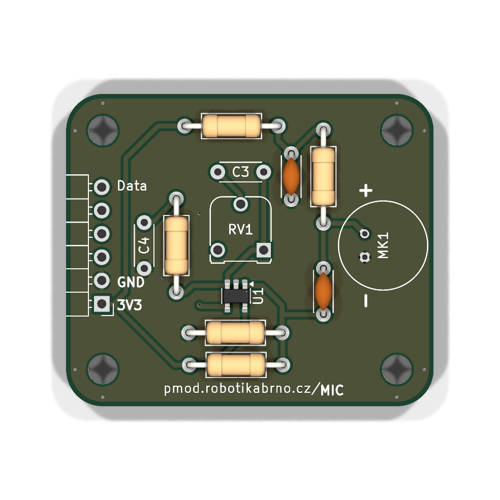

### 8. Kondenzátor

Zapájejte **C3** (kondenzátor, **100 pF**) na horní stranu DPS.

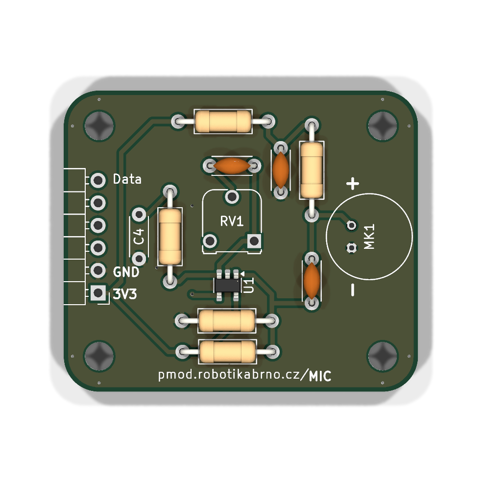

### 9. Kondenzátor

Zapájejte kondenzátor **C4** (**1 µF**) na horní stranu DPS.

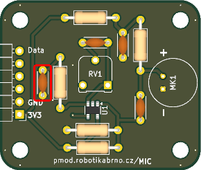

### 10. Pinový konektor 2.54 mm

Zapájejte pinový konektor **J1** na horní stranu desky.

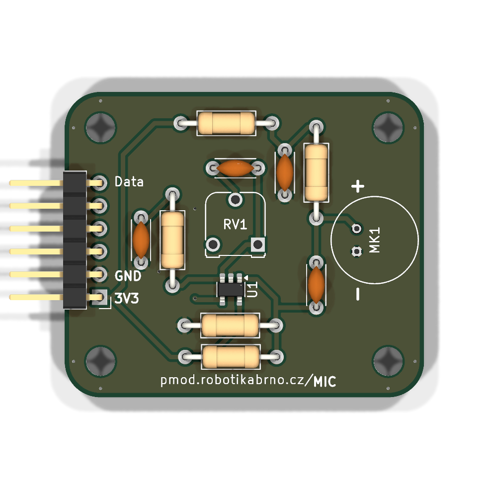

### 11. Potenciometr

Zapájejte potenciometr **RV1** (**100 kΩ**) na horní stranu DPS.

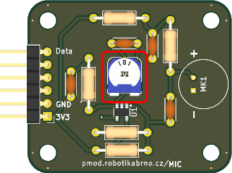

### 12. Mikrofon

Zapájejte **MK1** (mikrofon, **CMEJ-9745-37-P**) na horní stranu DPS.

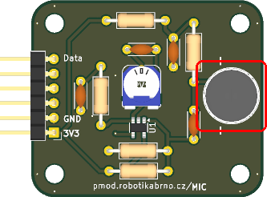
