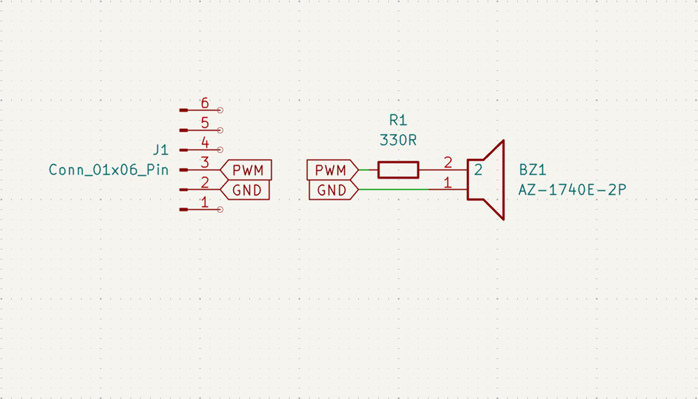
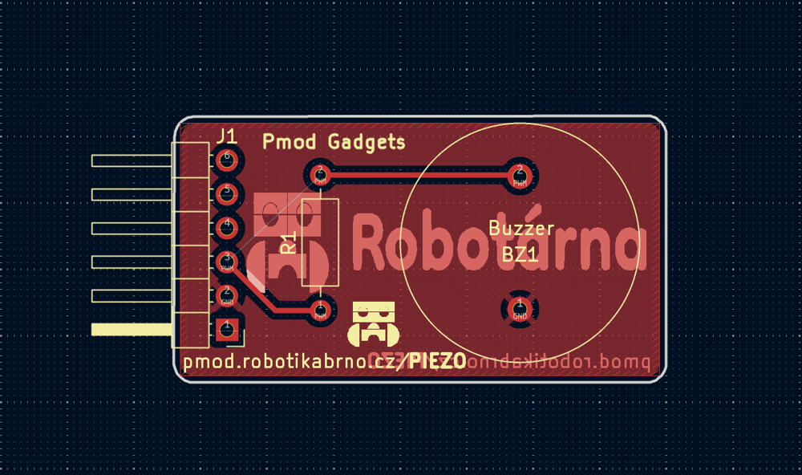
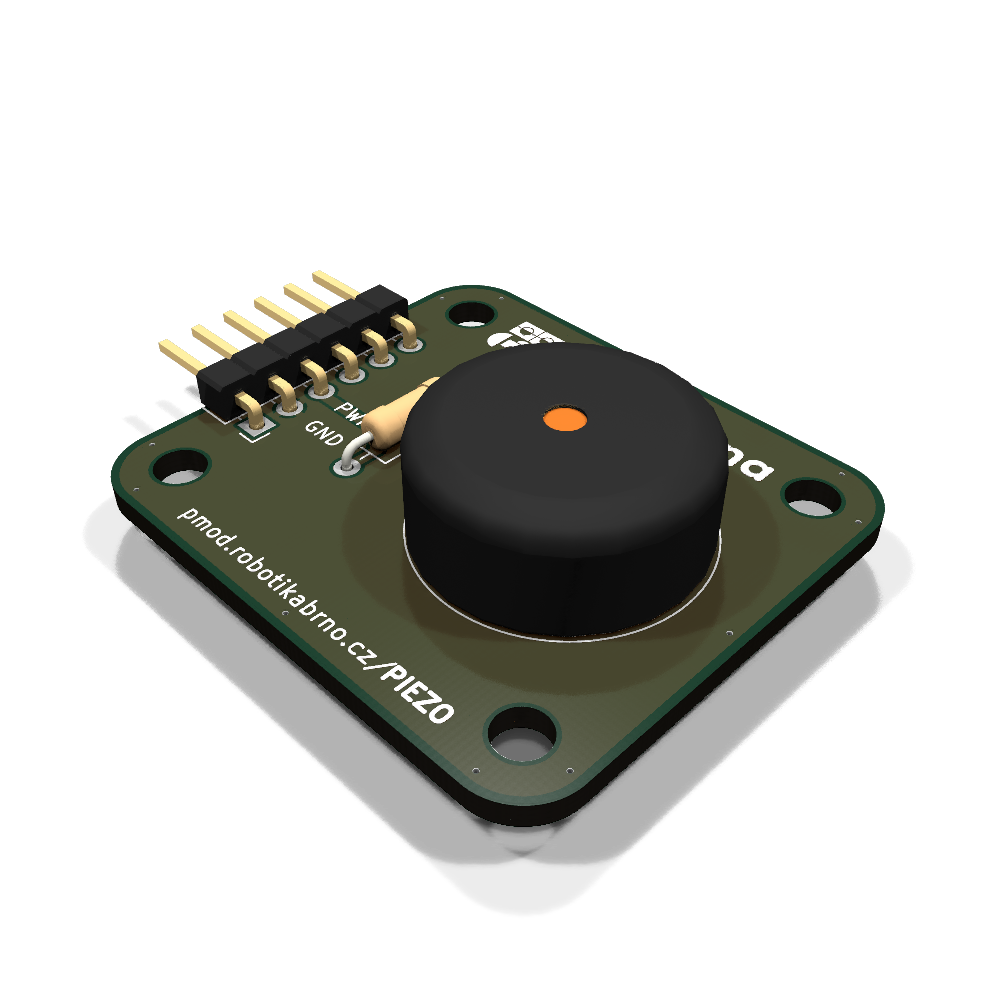

# Piezo modul

Piezo modul založený na [bzučáku Same-Sky CPT-1775-3TH](https://cz.mouser.com/ProductDetail/Same-Sky/CPT-1775-3TH?qs=yc9RBI4tIAK9HFcgM%252BStOQ%3D%3D)

Je potřeba 1 pin
- PWM (signál ovládání bzučáku)

