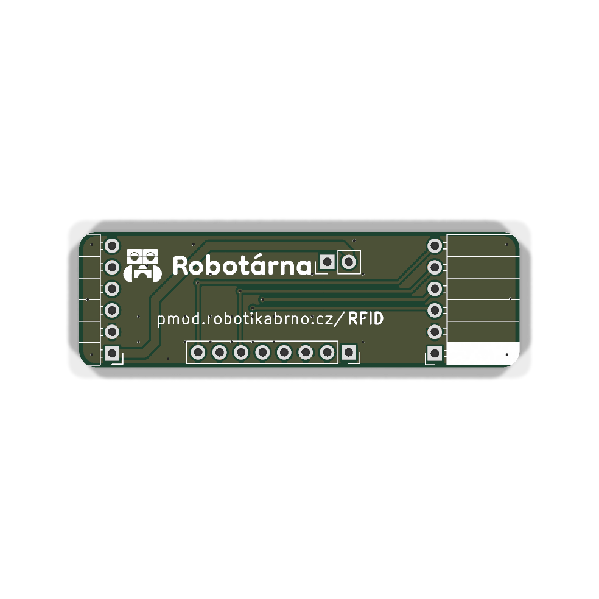
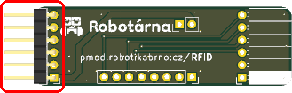
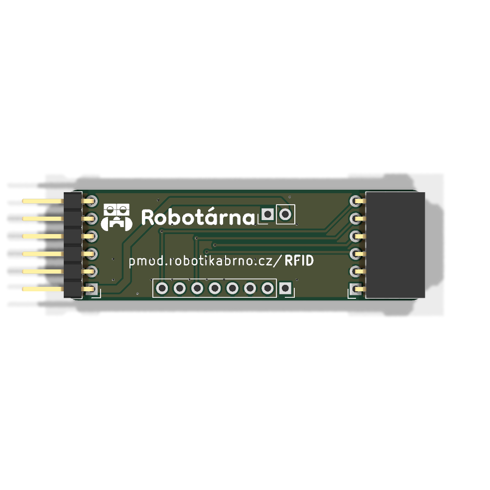
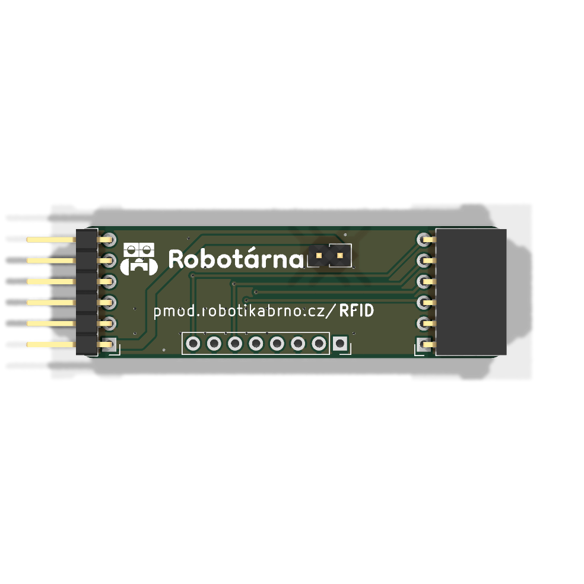
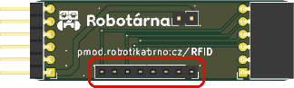

# Manuál k modulu

## Součástky

| Označení | Typ                     | Hodnota    | Počet |
| -------- | ----------------------- | ---------- | ----- |
| J2       | pinová lišta 2.54 mm    | RFID-RC522 | 1     |
| J3       | pinová lišta 2.54 mm    | —          | 1     |
| J1, J4   | pinový konektor 2.54 mm | —          | 2     |

### 1. Prázdná deska

Prázdná deska připravená k osazování.

### 2. Pinový konektor 2.54 mm

Zapájejte pinový konektor **J1** na horní stranu DPS.

### 3. Pinová lišta 2.54 mm

Zapájejte pinovou lištu **J3** na horní stranu desky.

### 4. Pinový konektor 2.54 mm

Zapájejte pinový konektor **J4** na horní stranu desky.

### 5. Pinová lišta 2.54 mm

Zapájejte pinovou lištu **J2** (**RFID-RC522**) na horní stranu desky.

