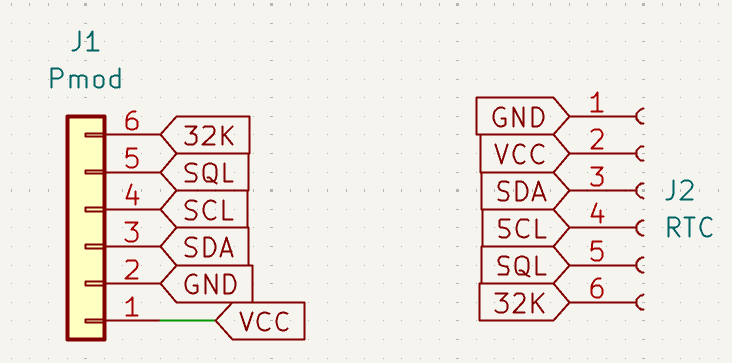
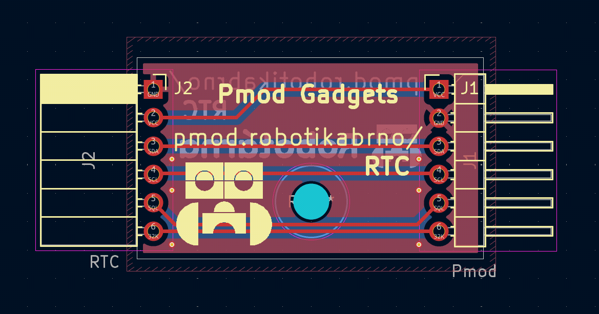

# RTC modul

Modul k propojení RTC s hlavní deskou pomocí PMOD konektoru. Použité RTC je [RTC-3231](https://www.aliexpress.com/item/1005006353193632.html?spm=a2g0o.productlist.main.1.28b3VRgwVRgw7O&algo_pvid=3272a9b4-4846-4c2b-a801-e36ef3f0f4ff&algo_exp_id=3272a9b4-4846-4c2b-a801-e36ef3f0f4ff-27&pdp_ext_f=%7B"order"%3A"2"%2C"eval"%3A"1"%2C"fromPage"%3A"search"%7D&pdp_npi=6%40dis%21CZK%219.86%217.69%21%21%213.32%212.59%21%402103891017594201966954948ecd97%2112000036863449254%21sea%21CZ%210%21ABX%211%210%21n_tag%3A-29910%3Bd%3A334d9f2b%3Bm03_new_user%3A-29895&curPageLogUid=aj2ZLW1VLTvr&utparam-url=scene%3Asearch%7Cquery_from%3A%7Cx_object_id%3A1005006353193632%7C_p_origin_prod%3A).

Jsou potřeba 4 piny + napájení:
- VCC (3.3V)
- GND (zem)
- SCL (Serial Clockv Line)
- SDA (Serial Data line)
+ 32k 
+ SQW

