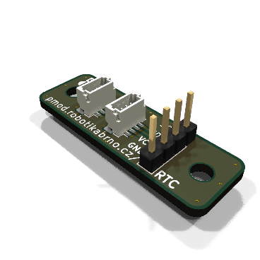
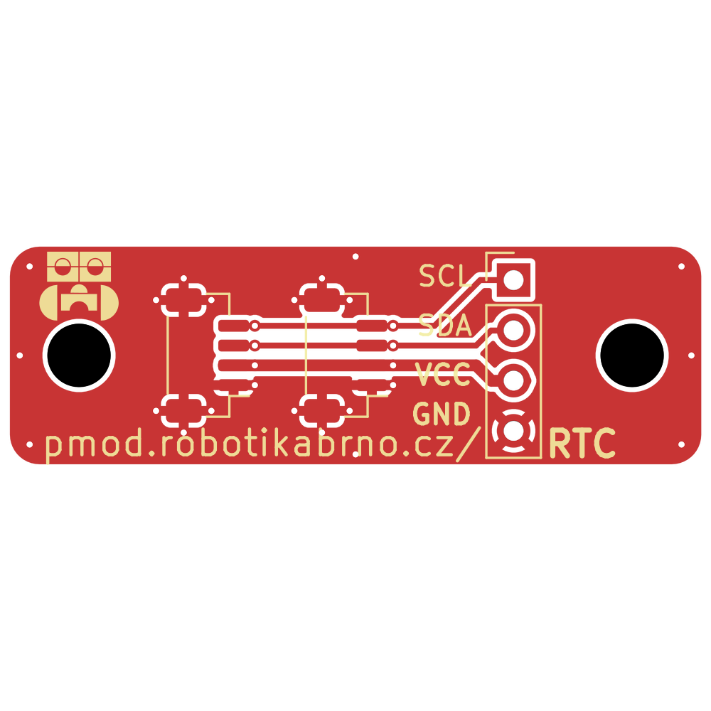
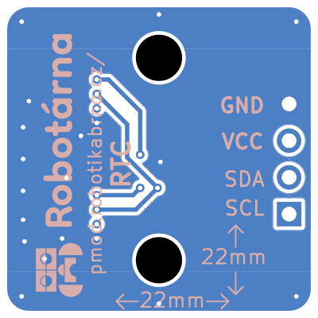
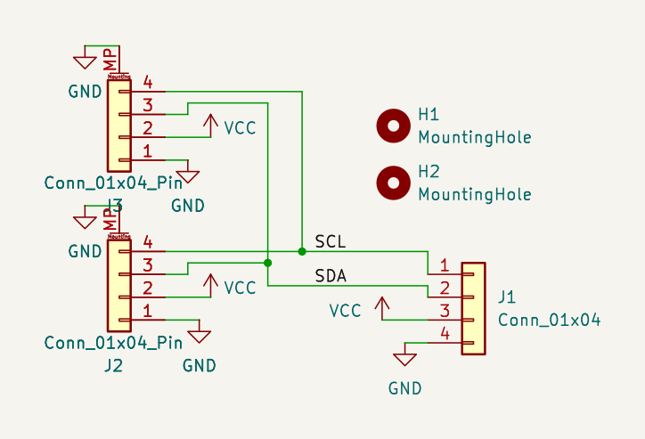

# Připojovací modul pro RTC (reálný čas)

Tato deska slouží jako propojovací rozhraní pro snadnou integraci externího RTC modulu (modulu reálného času) do vašeho projektu.

|  |  |
| --- | --- |

|  |  |
| --- | --- |

