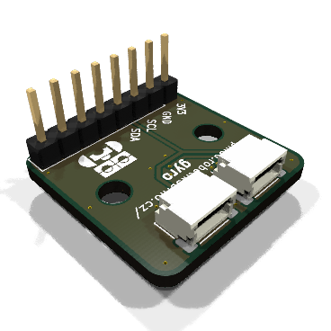
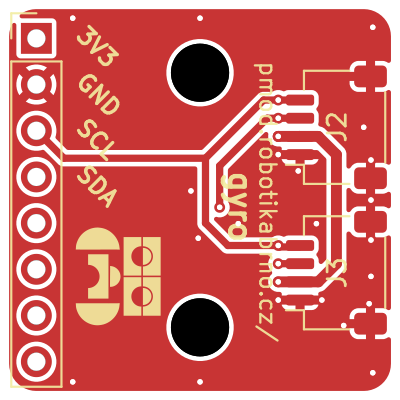
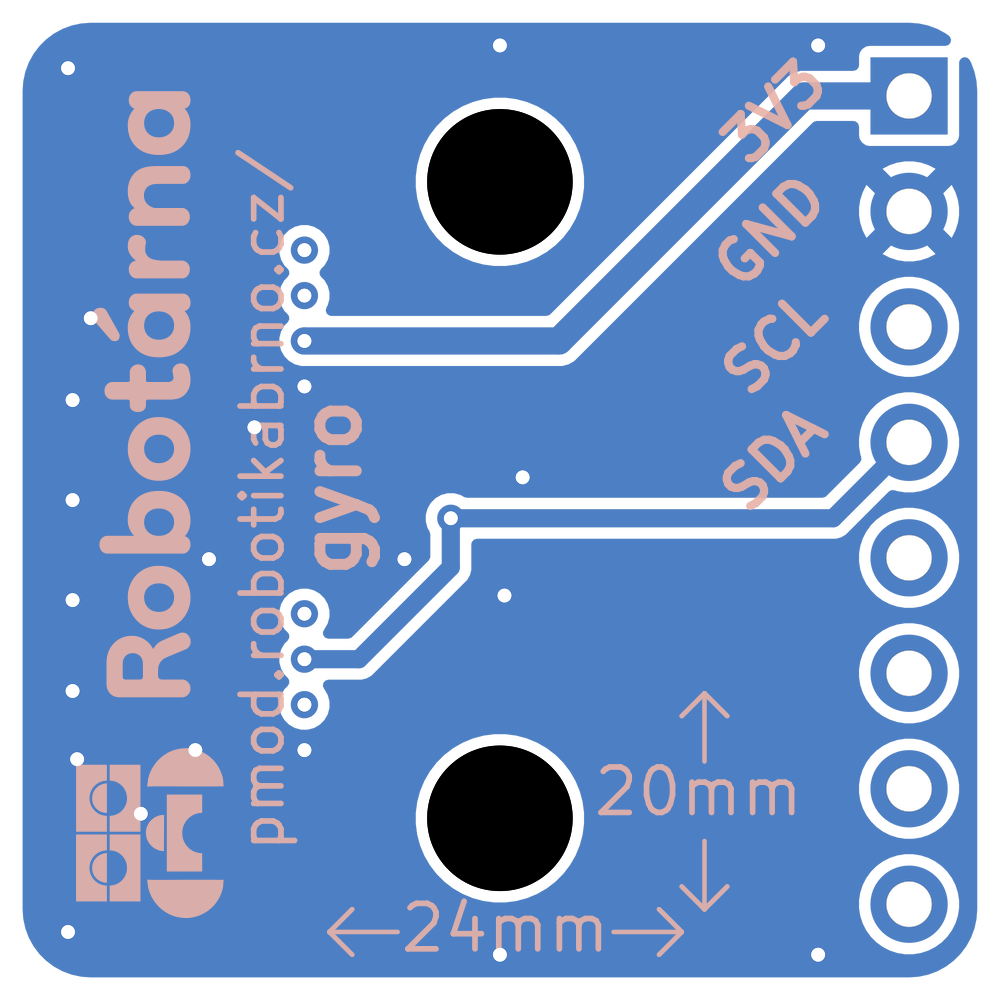
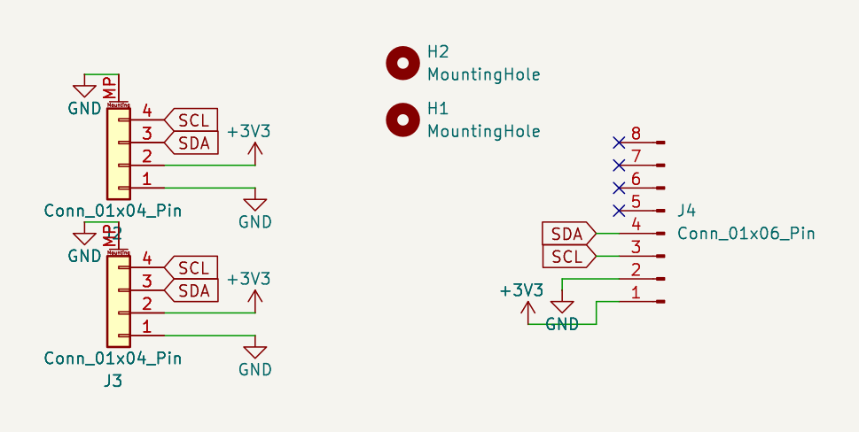

# Gyroskopický Senzor

Tento modul slouží ke snímání úhové rychlosti v různých osách. Umožňuje tak například měření otáčení nebo pohybu zařízení ve třech rovinách. Na desce jsou k dispozici konektory J2–J4 pro připojení a napájení modulu.

[Manuál](manual.md){ .md-button .md-button--primary }

|  |  |
| --- | --- |

