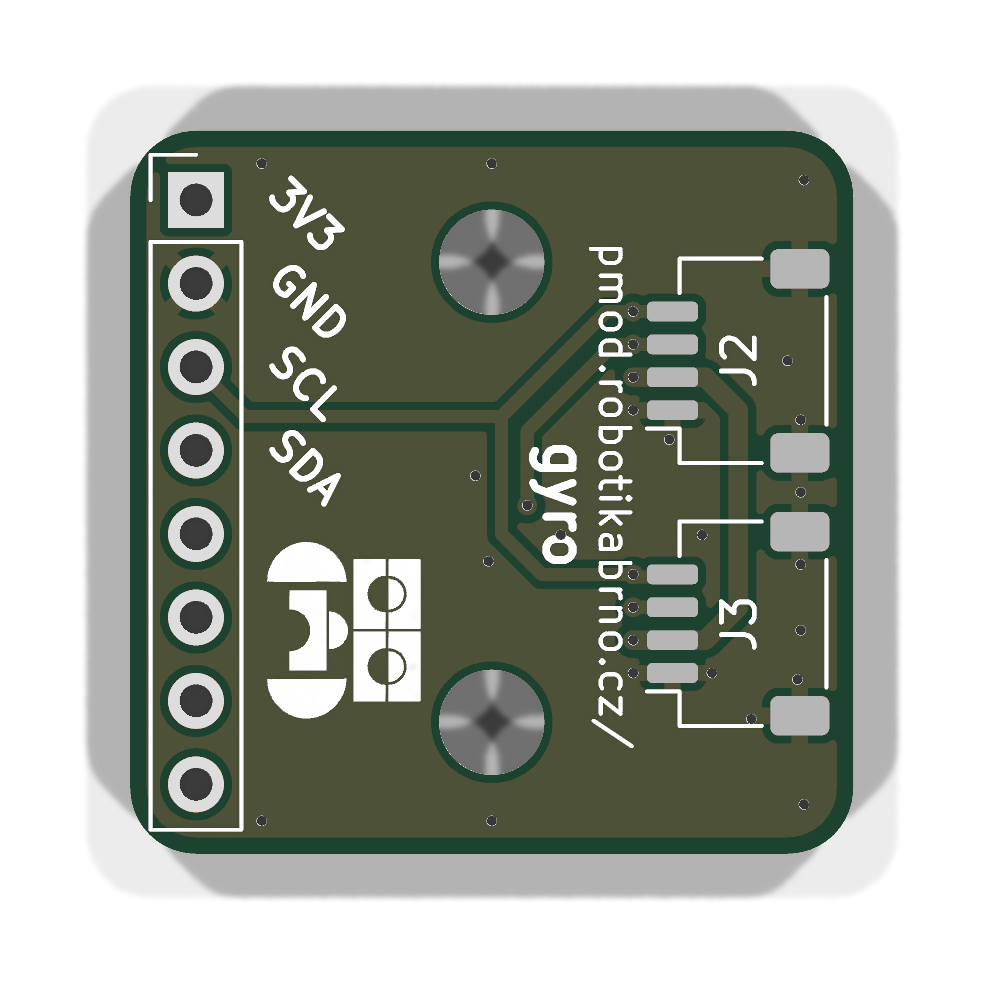
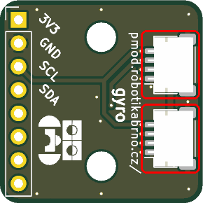
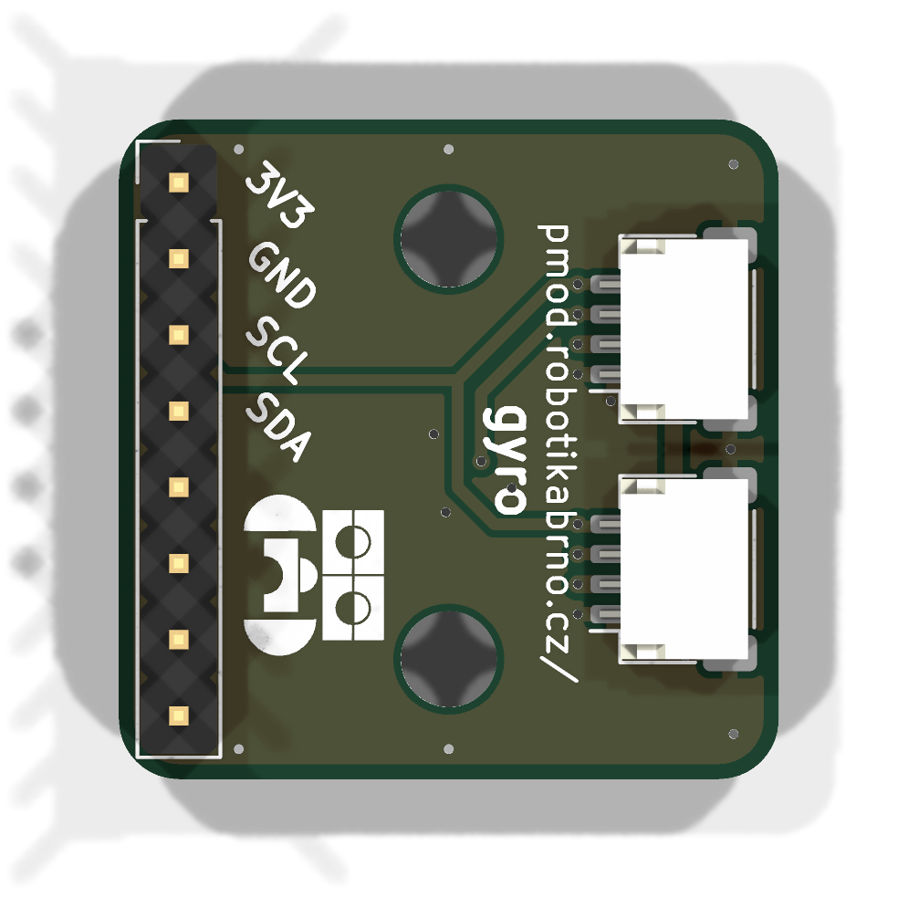

# Manuál k modulu

## Součástky

| Označení | Typ                     | Hodnota | Počet |
| -------- | ----------------------- | ------- | ----- |
| J2, J3   | JST SH konektor         | —       | 2     |
| J4       | pinový konektor 2.54 mm | —       | 1     |

### 1. Prázdná deska

Prázdná deska připravená k osazování.

### 2. JST SH konektory

Zapájejte **J2** a **J3** (JST SH konektor) na horní stranu desky.

### 3. Pinový konektor 2.54 mm

Zapájejte pinový konektor **J4** na horní stranu desky.

