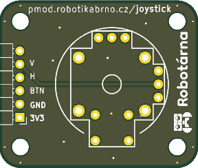
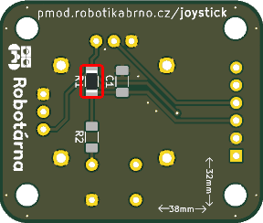
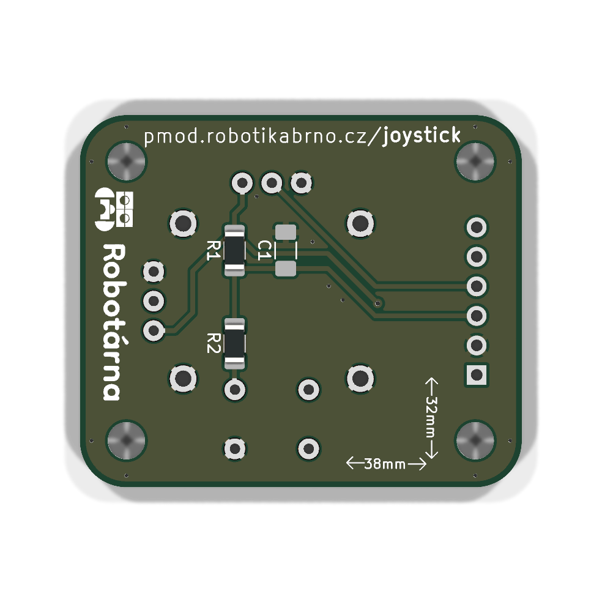
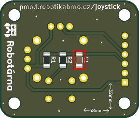
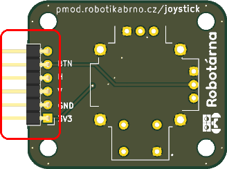
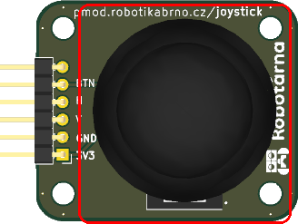

# Manuál k modulu

## Součástky

| Označení | Typ                     | Hodnota   | Počet |
| -------- | ----------------------- | --------- | ----- |
| U1       | joystick                | COM-09032 | 1     |
| C1       | kondenzátor             | 0.1 µF    | 1     |
| J1       | pinový konektor 2.54 mm | —         | 1     |
| R2       | rezistor                | 1 kΩ      | 1     |
| R1       | rezistor                | 10 kΩ     | 1     |

### 1. Prázdná deska

Prázdná deska připravená k osazování.

### 2. Rezistor

Zapájejte na spodní stranu DPS rezistor **R1** (rezistor, **10 kΩ**).

### 3. Rezistor

Zapájejte rezistor **R2** (rezistor, **1 kΩ**) na spodní stranu DPS.

### 4. Kondenzátor

Zaletujte kondenzátor **C1** (**0.1 µF**) na spodní stranu DPS.

### 5. Pinový konektor 2.54 mm

Zapájejte pinový konektor **J1** na horní stranu desky.

### 6. Joystick

Zapájejte joystick **U1** (**COM-09032**) na horní stranu DPS.

