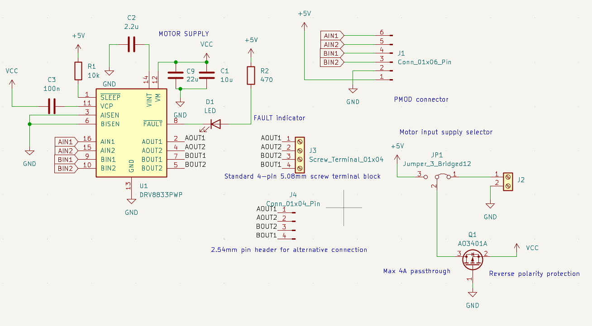
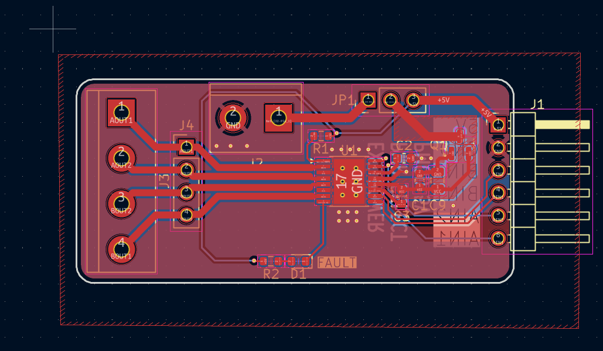
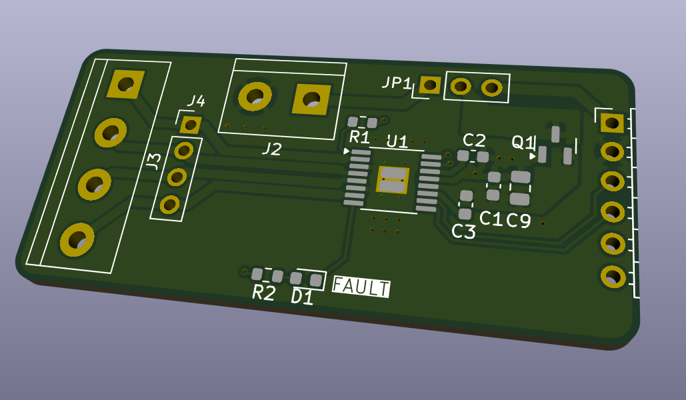

# Motor driver

PMOD modul co umí řídit dva DC motory, používá dual h-bridge DRV8833.
Má možnost využívat napětí z PMOD nebo externí napětí. Obsahuje také reverse polarity protection.

Připojení motorů je přes svorkovnici nebo přes 2.54mm pin header.

