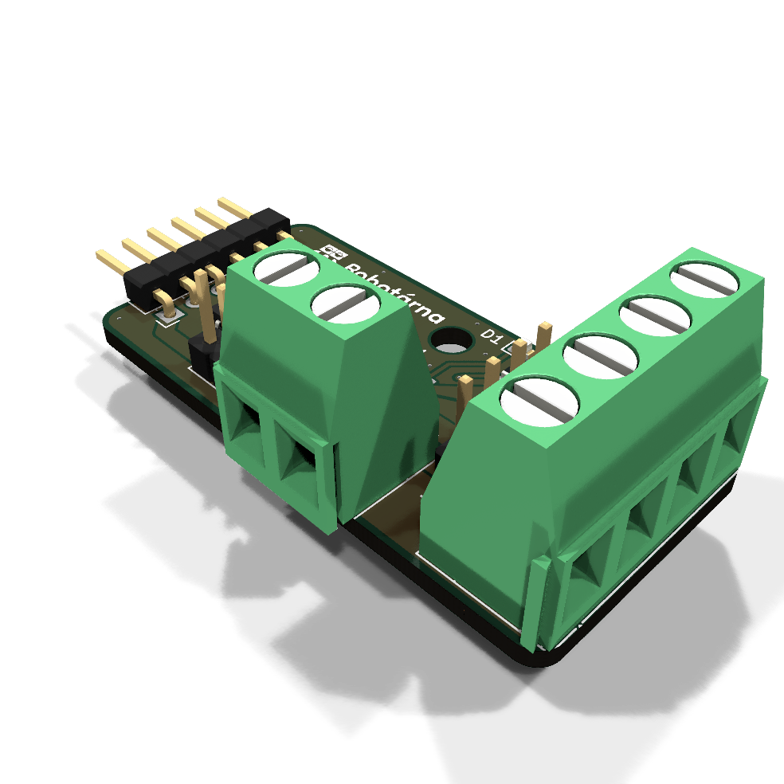
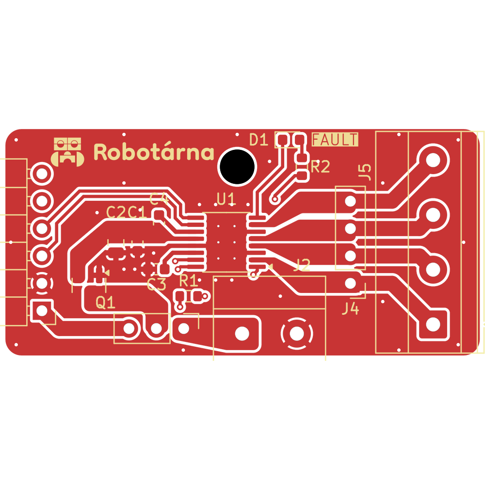
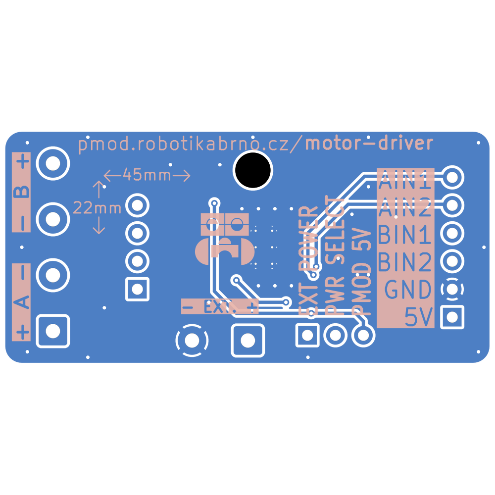
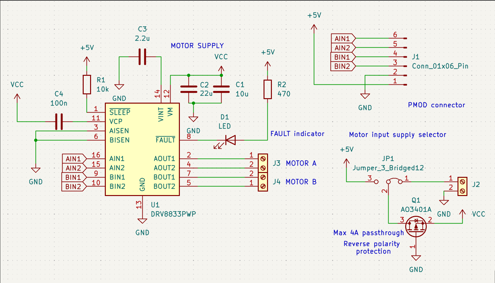

# Řídicí modul motoru

Tento PMOD modul slouží k řízení malých stejnosměrných motorů. Obsahuje integrovaný ovladač DRV8833PWP a několik pasivních součástek, které zajišťují stabilní provoz a ochranu obvodu. 

|  |  |
| --- | --- |

