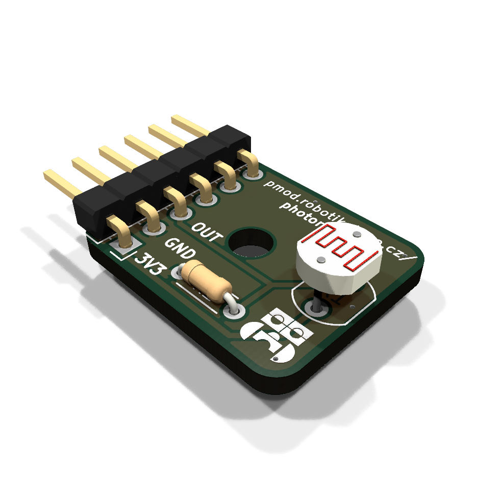
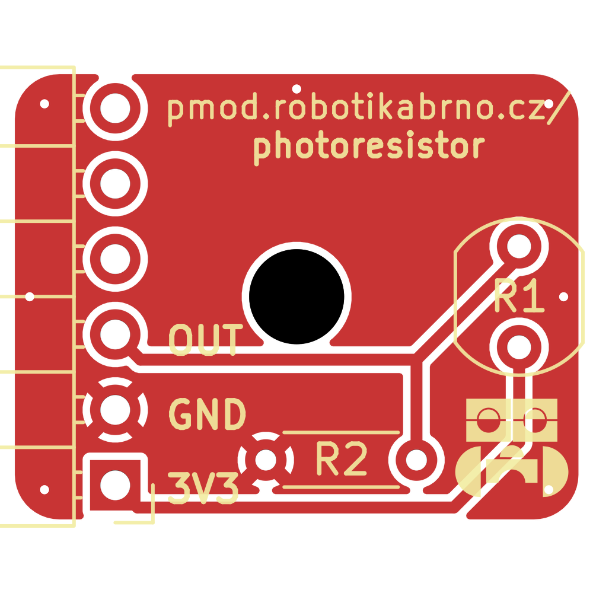
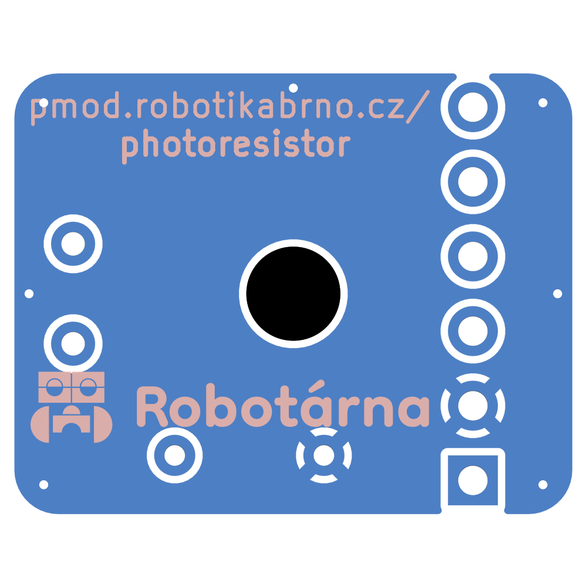
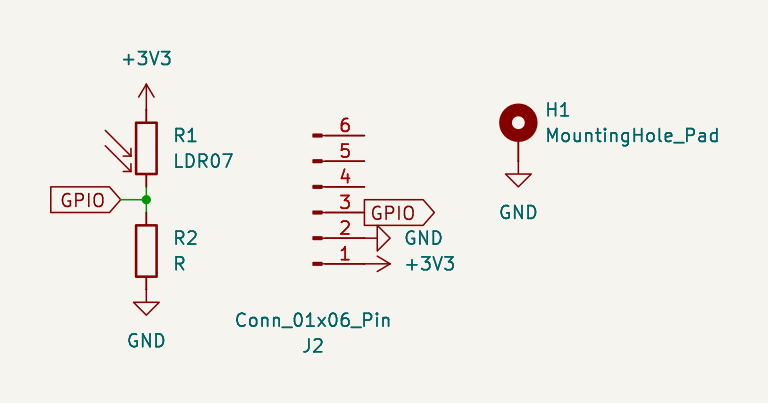

# Světelný senzor

Tento modul slouží k měření intenzity světla. Využívá fotorezistor LDR07 pro převod dopadajícího světla na změnu odporu, kterou lze následně otestovat pomocí mikrokontroléru.

|  |  |
| --- | --- |

