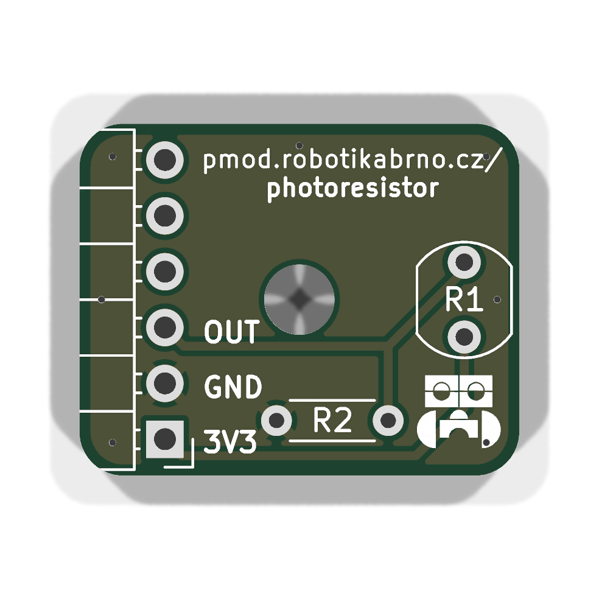
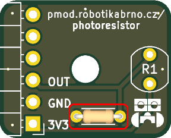
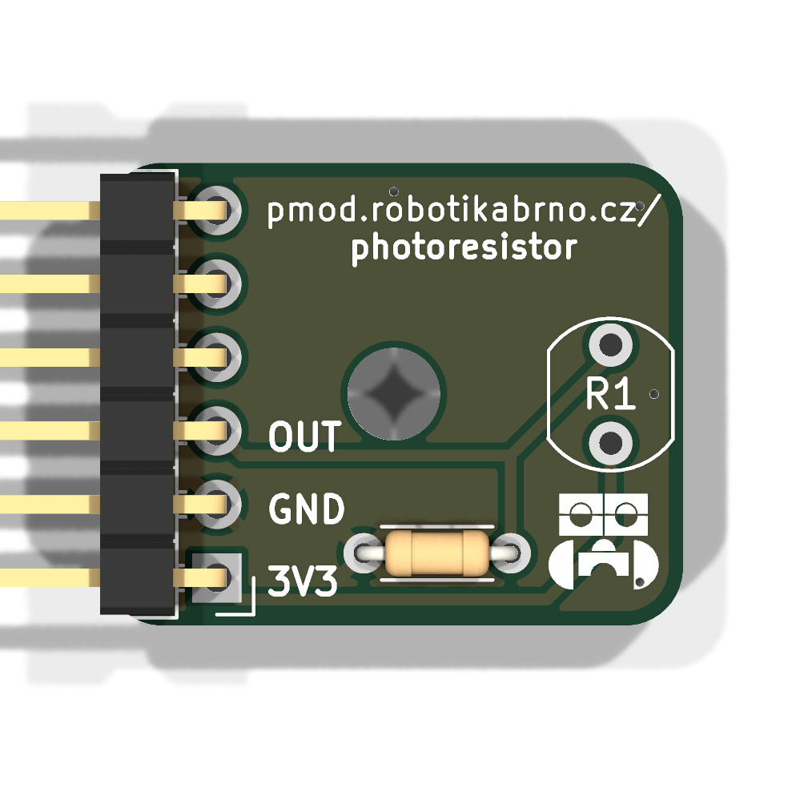
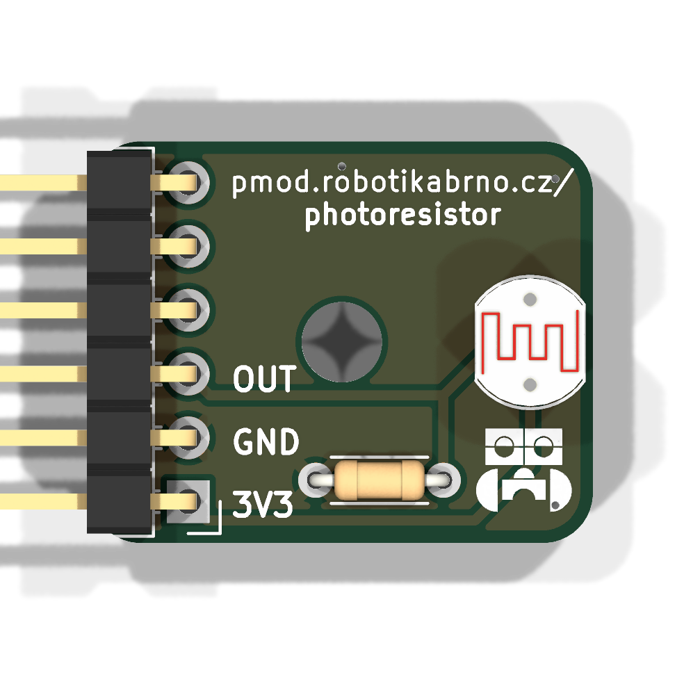

# Manuál k modulu

## Součástky

| Označení | Typ                     | Hodnota | Počet |
| -------- | ----------------------- | ------- | ----- |
| J2       | pinový konektor 2.54 mm | —       | 1     |
| R1       | rezistor                | LDR07   | 1     |
| R2       | rezistor                | 1kΩ       | 1     |

### 1. Prázdná deska

Prázdná deska připravená k osazování.

### 2. Rezistor

Zapájejte rezistor **R2** (1kΩ) na horní stranu DPS.

### 3. Pinový konektor 2.54 mm

Zapájejte pinový konektor **J2** na horní stranu desky.

### 4. Rezistor

Zapájejte rezistor **R1** (LDR07) na horní stranu DPS.

