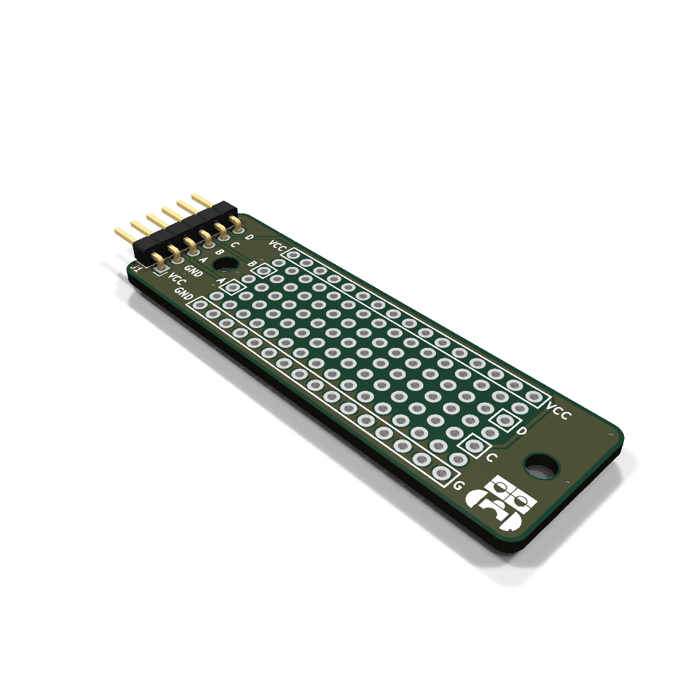
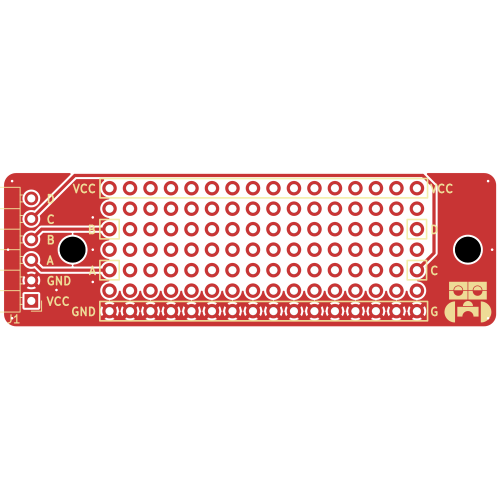
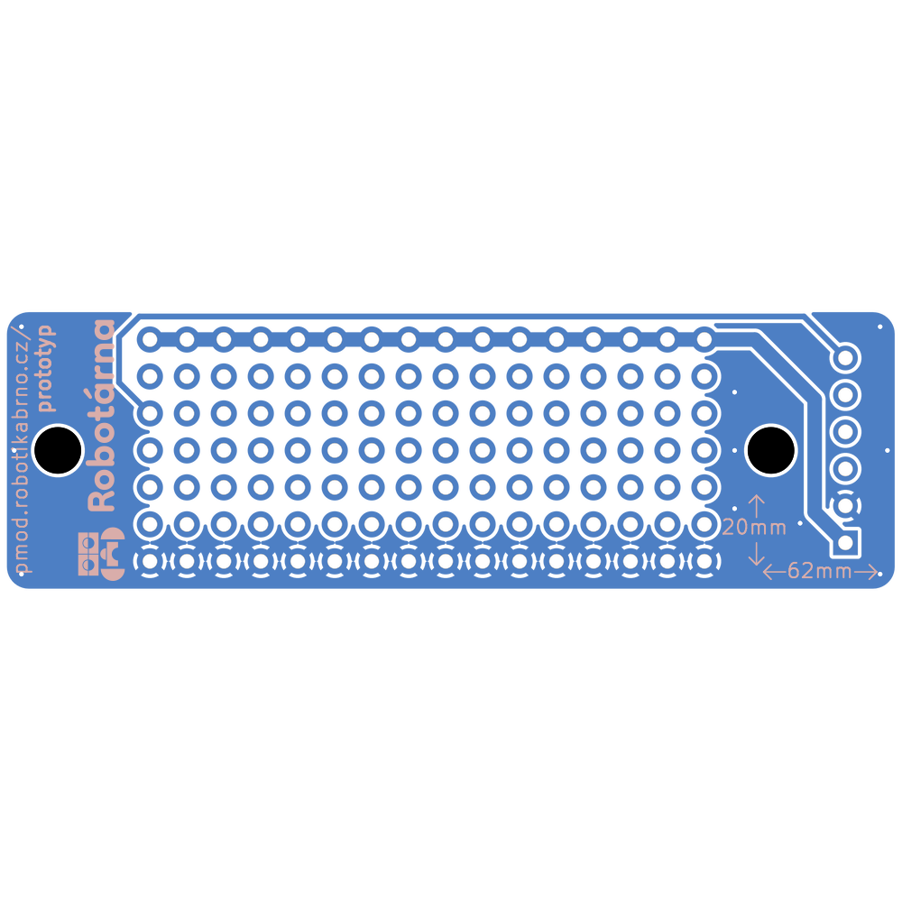
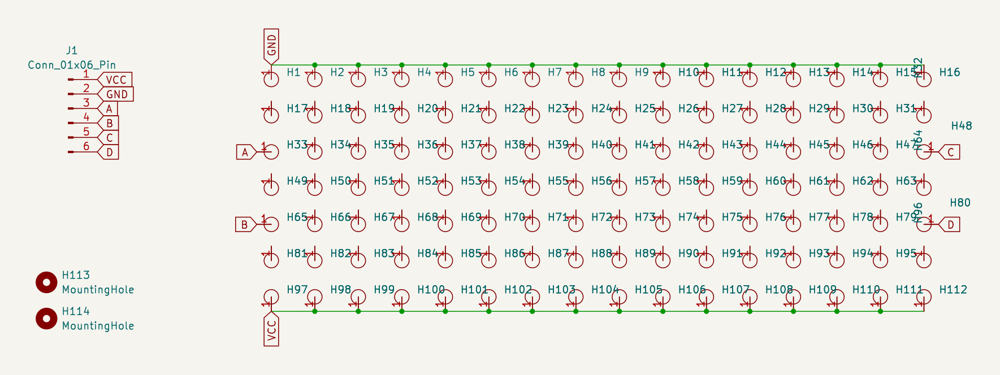

# Prototypovací modul PMOD

Tento modul slouží jako flexibilní platforma pro experimentování a rychlé vytváření prototypů elektronických obvodů. Nabízí základní PMOD konektor pro snadné připojení a testování různých komponent.

[Manuál](manual.md){ .md-button .md-button--primary }

|  |  |
| --- | --- |

