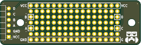
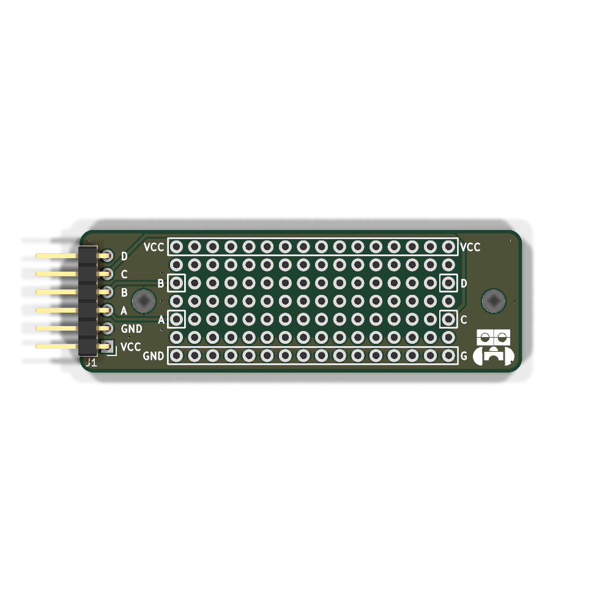

# Manuál k modulu

## Součástky

| Označení | Typ                     | Hodnota | Počet |
| -------- | ----------------------- | ------- | ----- |
| J1       | pinový konektor 2.54 mm | —       | 1     |

### 1. Prázdná deska

Prázdná deska připravená k osazování.

### 2. Pinový konektor 2.54 mm

Zapájejte pinový konektor **J1** na horní stranu desky.

