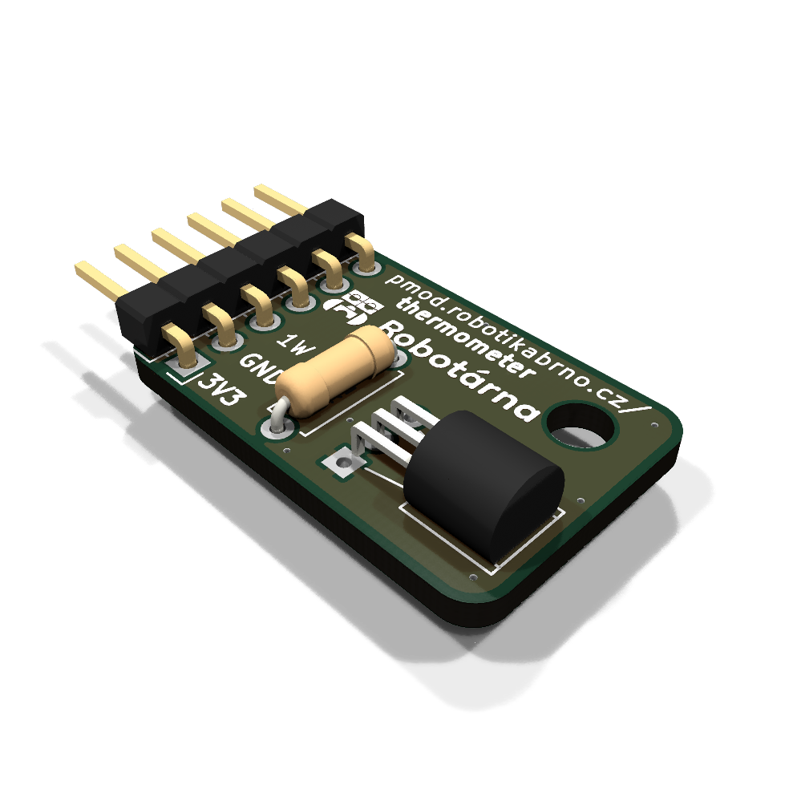
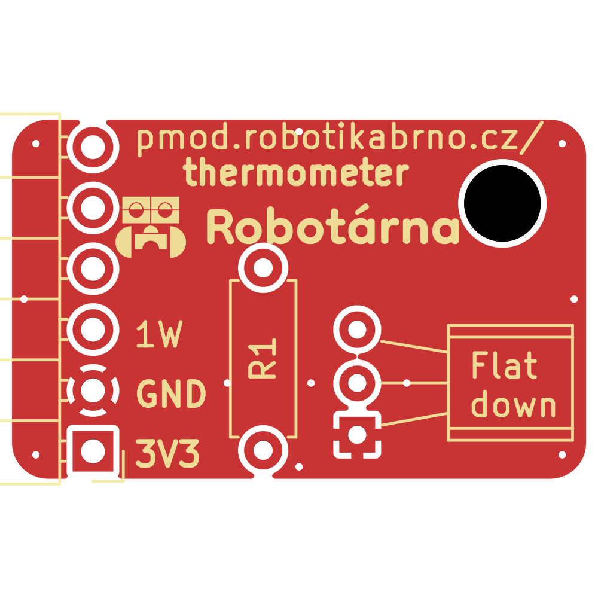
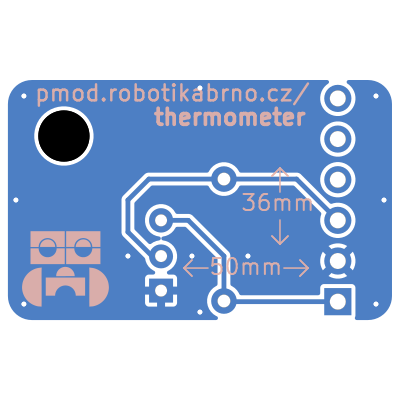
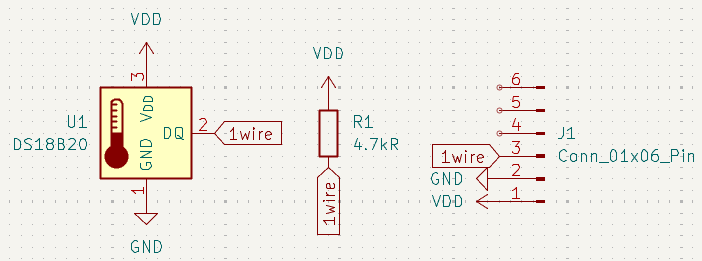

# Senzor teploty

Senzor teploty založený na [DS18B20](https://www.analog.com/media/en/technical-documentation/data-sheets/ds18b20.pdf)

#### Využívá napájení a 1 pin
- 1wire – komunikace s DS18B20

|  |  |
| --- | --- |

