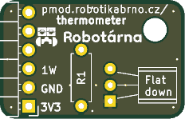
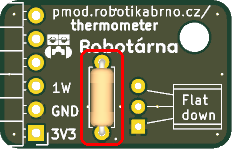
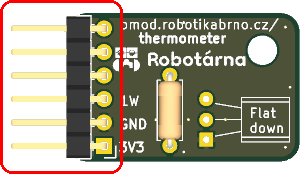
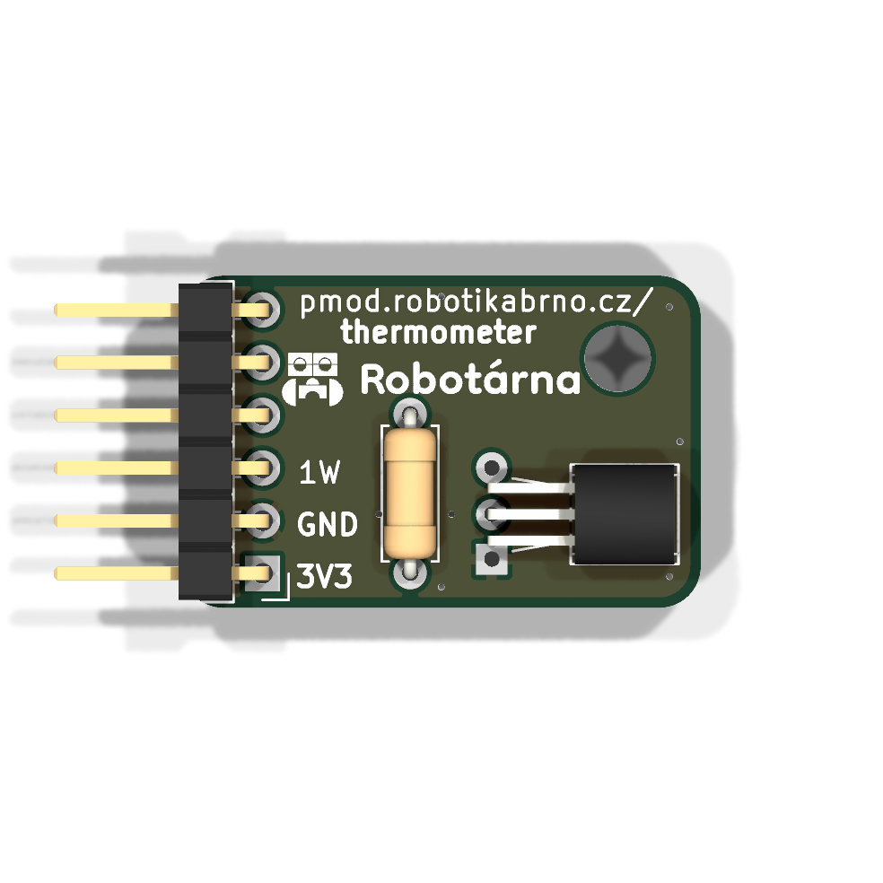

# Manuál k modulu

## Součástky

| Označení | Typ                     | Hodnota | Počet |
| -------- | ----------------------- | ------- | ----- |
| J1       | pinový konektor 2.54 mm | —       | 1     |
| R1       | rezistor                | 4.7 kΩ  | 1     |
| U1       | teploměrný senzor       | DS18B20 | 1     |

### 1. Prázdná deska

Prázdná deska připravená k osazování.

### 2. Rezistor

Zapájejte rezistor **R1** (rezistor, **4.7 kΩ**) na horní stranu DPS.

### 3. Pinový konektor 2.54 mm

Zapájejte pinový konektor **J1** na horní stranu desky.

### 4. Teploměrný senzor

Zapájejte teploměrný senzor **U1** (**DS18B20**) na horní stranu DPS.

